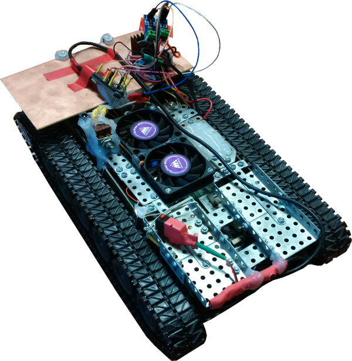
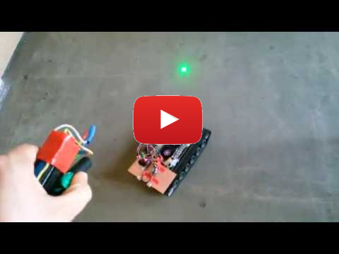
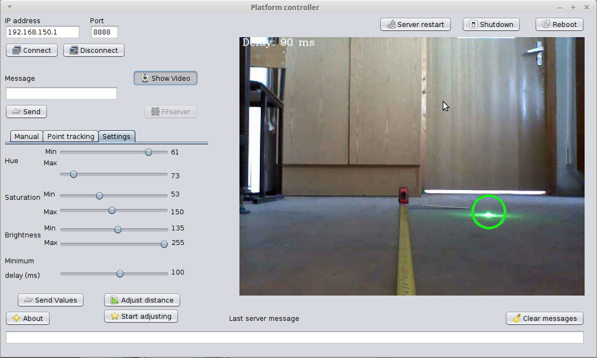
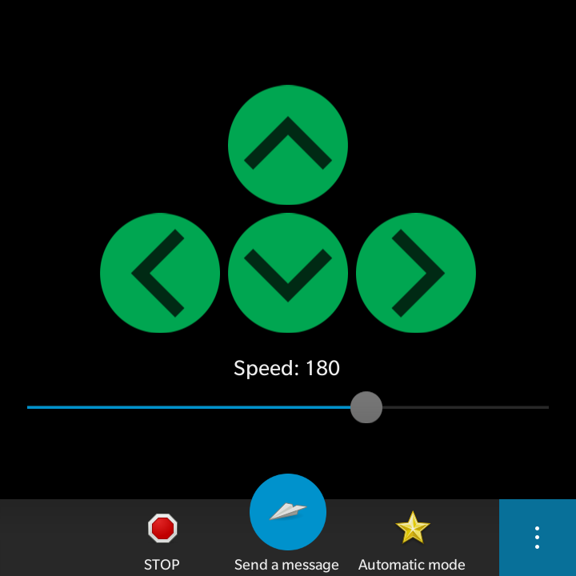

# Проект по созданию мобильной роботизированной платформы  
В рамках студенческого проекта был собран мобильный робот на основе игрушечного танка.  
На роботе установлена бортовая ЭВМ с процессором Intel Atom (разобранный нетбук). Работает под управлением GNU/Linux (Lubuntu 14.10).  
Для связи с оператором бортовая ЭВМ создаёт точку доступа Wi-Fi.  
Для управления двигателями используется Arduino Nano.  
Обратная связь осуществляется с помощью датчиков тока, измеряющих ток в обмотках двигателей.   
Платформа используется для демонстрации на днях открытых дверей в вузе.  
Этому роботу посвящена моя бакалаврская выпускная квалификационная работа.  

## Возможности робота:  
- ручное управление по Wi-Fi (протокол TCP);  
- передача изображения с камеры оператору (протокол UDP);  
- следование за пятном лазерной указки.  

## Состав:  
### Программа бортовой ЭВМ  
Программа, автоматически запускаемая после загрузки ОС бортовой ЭВМ.  
Исполняемый файл - *tank_server.jar* в папке *bin*.  
Написана на **Java**, среда разработки NetBeans. 
Для поиска пятна лазерной указки используется **OpenCV 2.4.11** в обёртке **JavaCV 2.8**.  
Для передачи управляющих команд на Arduino - библиотека работы с последовательным портом **jSSC 2.8**.  
  
### Программа оператора 
Программа, позволяющая управлять роботом, просматривать изображение с его камеры, производить его настройку.  
Исполняемый файл - *tank.jar* в папке *bin*.  
Написана на **Java**, среда разработки NetBeans.  
Для запуска требуется JRE (OpenJDK) 7.  
  
### Скетч Arduino 
Скетч для Arduino, позволяющий управлять двигателями по командам, поступающим с последовательного порта.  
Также реализует системы автоматического регулирования линейной и угловой скоростей робота.  
Написан на **С++**.  
  
### Программа оператора для BlackBerry 10  
Программа позволяет управлять роботом со смартфона под упарвлением ОС BlackBerry 10.3.1 и новее.  
Поддерживаются только базовые функции, такие как ручное управление и включение следования за указкой.  
Написана на **C++** с использованием **Qt 4** и фреймворка Cascades, среда разработки Momentics IDE.   
  
### Документы
Имеется инструкция по эксплуатации робота, его техническое описание. Также прилагается выпускная работа, посвящённая ему.  
  
  

    
    
  
  
   
  
Основные работы, связанные с аппаратным обеспечением и сборкой робота осуществлял [Безхмельнов Андрей](https://github.com/russian-guy). Платформу - игрушечный танк предоставил Гудилин Евгений, он также оказывал помощь в разработке.  
Барашков А.А., Безхмельнов А.Д., Гудилин Е.С. 2015 - 2016
